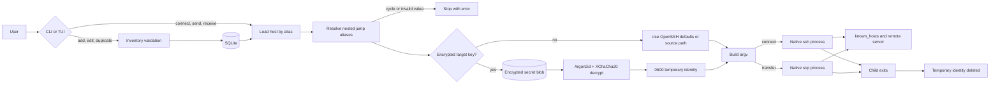
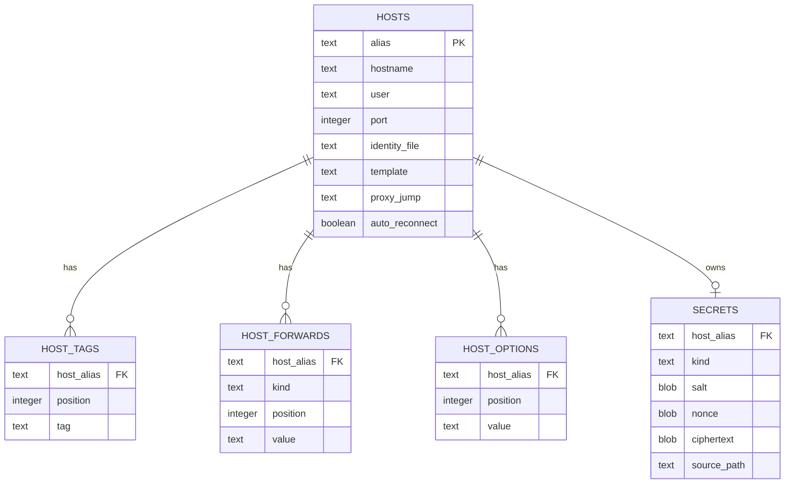

import architectureFlow from '@site/static/img/architecture-flow.png';

sshnav keeps policy and persistence local while delegating transport to OpenSSH. SQLite is authoritative; generated SSH config is optional disposable output.

<figure className="diagram-frame">
  
  <figcaption className="diagram-caption">Eraser export of the sshnav execution architecture.</figcaption>
</figure>

A source-equivalent [Mermaid version](/diagrams/architecture-flow.mmd) is available for text-based edits.

## Execution flow

## Module boundaries

| Module | Responsibility |
| --- | --- |
| `cli` | Clap commands, typo suggestions, and orchestration |
| `inventory` | Host/template model and trust-boundary validation |
| `storage` | SQLite migrations, normalized host data, and encrypted blobs |
| `secrets` | Local-key management, encryption, decryption, and temporary key files |
| `runner` | Safe SSH/SCP argument construction and process lifecycle |
| `diagnostics` | Shared recursive jump resolution and TCP hop checks |
| `ssh_config` | Conservative OpenSSH import with wildcard/default merging |
| `generator` | Optional managed OpenSSH include rendering |
| `picker` | Searchable terminal host navigator and reachability workers |
| `add_form` | Interactive add, edit, and duplicate forms |
| `doctor` | Environment, permission, binary, include, and identity checks |

## Persistence model

Ordered child tables preserve the order of tags, forwards, and options. Foreign-key cascades remove child records and secrets when a host is deleted.

## Private-key lifecycle

Imported key bytes are encrypted before storage. During a connection, the encrypted blob is read, decrypted with the local owner-only key, and written to a private runtime file. `PreparedCommand` owns the temporary file so Rust's lifetime and cleanup behavior keep it available exactly until the native child command exits.

## Jump-chain resolution

The diagnostics resolver is shared with the runner so observed and executed routes cannot diverge. Saved aliases recursively expand to `[user@]hostname[:port]`; literal OpenSSH hops remain unchanged. A recursion stack catches self-references and longer cycles.

## Generated configuration

`sshnav generate` renders an optional OpenSSH include from the inventory. It omits source identity paths for hosts with encrypted copies because OpenSSH cannot consume encrypted database records. Users can delete and regenerate this file at any time.
